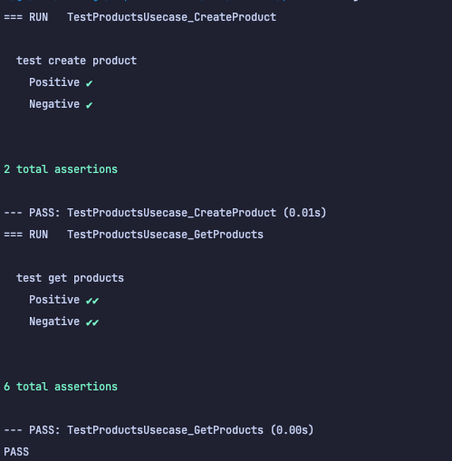

# Superindo
    Restful for Superindo

## Prerequisites
    - Go 1.22
    - Fiber
    - Mysql
    - Gorm
    - Swaggo
    - Docker

## How to use
```bash
    git clone github.com/rasyidmm/superindo
    cd superindo
    docker-compose up -d
```

## IP
    Server : http://172.28.0.2:3000/
    Database : 172.28.0.3
    Redis : 172.28.0.4
    Swagger : http://172.28.0.2:3000/swagger/index.html

## Postman
    dapat melakukan dengen postman
- [Link Postman](https://github.com/rasyidmm/superindo/blob/master/superindo.postman_collection.json)

## Unit Test
```bash
    cd src/usecase/products 
    go test -v -cover
```
